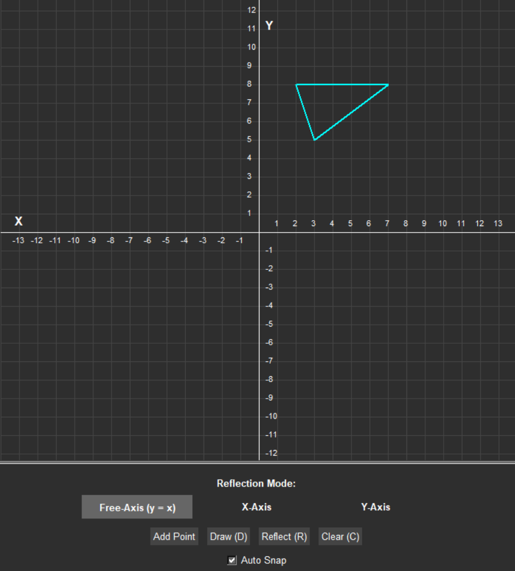

Here is the updated `README.md` styled exactly like the **Leon Template** repository, complete with a clean header alignment, structured feature blocks, global color palette accents, and embedded preview screenshots.

Replace everything currently in your `README.md` with this:

```markdown
# ReflectX 📐✨

A sleek, interactive Computer Graphics application built with Python's `Turtle` and `Tkinter` libraries. **ReflectX** allows users to dynamically plot 2D polygons on a cartesian grid and perform fundamental geometric transformations, focusing on reflections across the **X-axis**, **Y-axis**, and the **Free-Axis ($y = x$)** using homogeneous coordinate transformation matrices.

## Global Color Palette
* Main Cyan Color: `#00ffff`
* Main Red Color: `#ff4444`
* Background Dark: `#2e2e2e`

---

## Project Previews

### 1. Shape Canvas Drawing


### 2. X-Axis Reflection


### 3. Y-Axis Reflection


### 4. Free-Axis ($y = x$) Reflection


---

## Features

* **Interactive Canvas:** Easily plot custom polygons by clicking directly on the graphical coordinate system grid.
* **Auto Snap-to-Grid:** Built-in automatic grid alignment system (`Auto Snap`) ensuring coordinate precision by snapping vertex selections to the nearest grid intersection (25px scale increments).
* **Advanced 2D Transformations:** Custom math engine utilizing **NumPy** for multi-dimensional matrix multiplications in homogeneous coordinates.
* **Responsive Control Panel:** Built with an elegant dark theme using seamless integration between `tkinter` UI modules and `turtle` drawing canvases.
* **Keyboard Shortcuts:** Built-in listeners for efficient execution mapping:
  * `D`: Draw Shape
  * `R`: Reflect Shape
  * `C`: Clear Screen

---

## Matrix Transformation Engine

ReflectX leverages **Homogeneous Coordinates** to encapsulate affine transformations into compact 3x3 matrices, enabling seamless linear algebraic transformations:

### Reflection across X-Axis ($y = 0$)
$$\begin{bmatrix} x' \\ y' \\ 1 \end{bmatrix} = \begin{bmatrix} 1 & 0 & 0 \\ 0 & -1 & 0 \\ 0 & 0 & 1 \end{bmatrix} \begin{bmatrix} x \\ y \\ 1 \end{bmatrix}$$

### Reflection across Y-Axis ($x = 0$)
$$\begin{bmatrix} x' \\ y' \\ 1 \end{bmatrix} = \begin{bmatrix} -1 & 0 & 0 \\ 0 & 1 & 0 \\ 0 & 0 & 1 \end{bmatrix} \begin{bmatrix} x \\ y \\ 1 \end{bmatrix}$$

### Reflection across Free-Axis ($y = x$)
$$\begin{bmatrix} x' \\ y' \\ 1 \end{bmatrix} = \begin{bmatrix} 0 & 1 & 0 \\ 1 & 0 & 0 \\ 0 & 0 & 1 \end{bmatrix} \begin{bmatrix} x \\ y \\ 1 \end{bmatrix}$$

---

## Installation & Setup

### Prerequisites
Make sure you have **Python 3.x** installed on your system along with the required dependencies.

### Dependencies
Install the required packages using `pip`:
```bash
pip install numpy

```

*Note: `turtle` and `tkinter` are part of Python's standard library and do not require separate installation.*

### Running the Application

Clone this repository and run the script:

```bash
python CG_project.py

```

---

## How to Use

1. **Plot Vertices:** Click anywhere on the dark grid area to add custom vertices, or click the **Add Point** button to manually enter exact values.
2. **Form Polygon:** Press the `D` key or click the **Draw (D)** button to bind all plotted coordinate dots into a cyan-highlighted custom polygon.
3. **Select Mode:** Choose a reflection target method under the **Reflection Mode** section (*Free-Axis*, *X-Axis*, or *Y-Axis*).
4. **Transform:** Press the `R` key or click the **Reflect (R)** button to calculate and render the transformed geometry in vibrant red.
5. **Reset:** Press `C` or click **Clear (C)** to refresh the board coordinates.

---

## File Structure

```text
├── CG_project.py         # Main Python source application script
├── axes.ico              # Custom window application icon
├── draw.png              # Interface preview graphic asset
├── reflect x-axis.png    # Interface preview graphic asset
├── reflect y-axis.png    # Interface preview graphic asset
└── reflect free-axis.png # Interface preview graphic asset

```

---

## License

This project is open-source and available under the **MIT License**. Feel free to use, modify, and distribute!

```

```